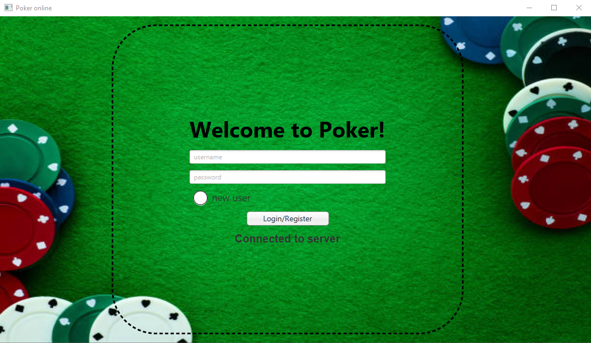
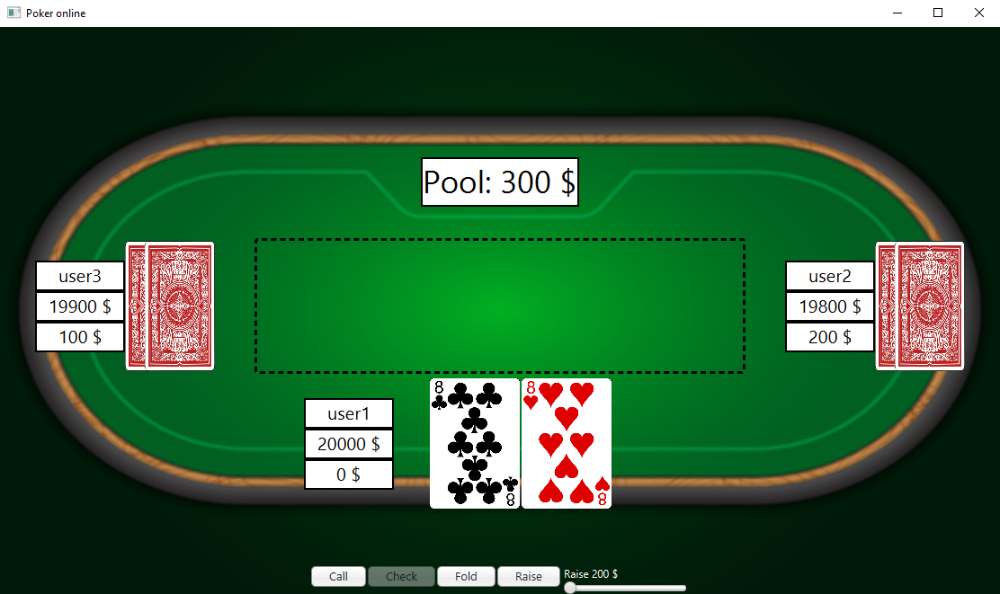
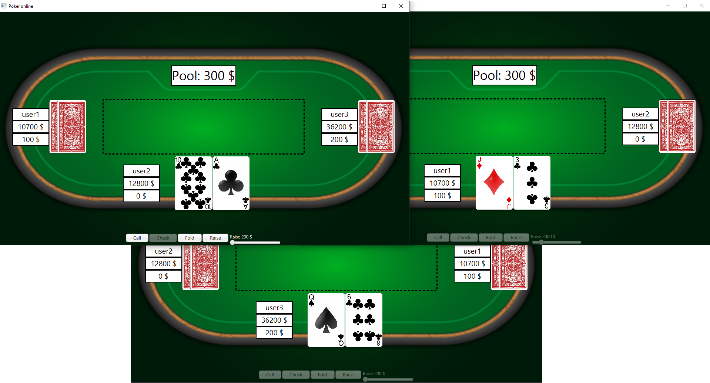
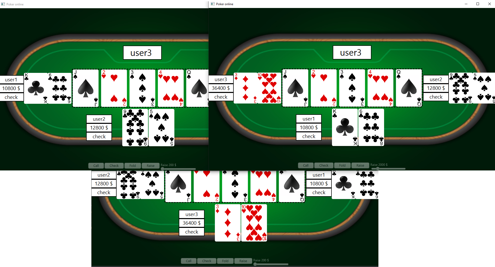

# PokerOnline

The project implements a famous card game Poker with the use of Java and a graphical user interface made with JavaFX.

The primary goal of creating this project was to learn how to implement a Client-Server Architecture using Socket Programming and therefore make it possible for the players to play together through the internet.

## Login screen

## Start of the game

## Flop

## Pick a winner

